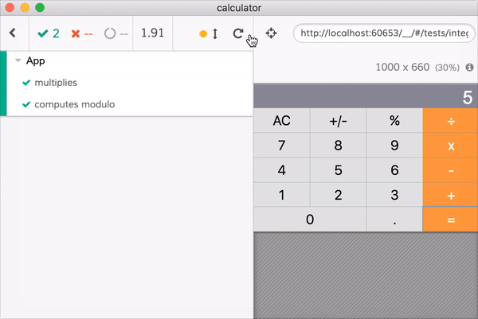

Calculator  [![renovate-app badge][renovate-badge]][renovate-app] 
---

Shows unit testing React components from [src/component](src/component) folder using [Cypress test runner](https://www.cypress.io/).

* [cypress/integration/app-spec.js](cypress/integration/app-spec.js)
* [cypress/integration/button-spec.js](cypress/integration/button-spec.js)

Created with *create-react-app*. See the [full create-react-app guide](https://github.com/facebookincubator/create-react-app/blob/master/packages/react-scripts/template/README.md).

Try It
---

[ahfarmer.github.io/calculator](https://ahfarmer.github.io/calculator/)

Install
---

`npm install`

Usage
---

`npm start`

[renovate-badge]: https://img.shields.io/badge/renovate-app-blue.svg
[renovate-app]: https://renovateapp.com/
